# DSAIT-GROUP 13 ~ Style Transfer ~

## Clone repository and model weights

To clone the repo:
```
git clone --recurse-submodules https://gitlab.ewi.tudelft.nl/cgv/dsait4120/student-repositories/2024-2025/dsait4120-24-group13.git
cd dsait4120-24-group13
```

We use Git LFS (Large file system) to track model weights. Install LFS on your computer and do:
```
git lfs pull
```

If you have troubles installing GitLFS, download decoder.pth / vgg_normalized.pth from [release](https://github.com/naoto0804/pytorch-AdaIN/releases/tag/v0.0.0) and put them under `Style_3DGS/AdaIN/models/`

## Install

**Attention:** 3D-Gaussian Splatting repository makes use of its own differentiable-rasterizer (built as a submodule). To build this successfuly you must have Microsoft [Visual Studio Build Tools **2019**](https://aka.ms/vs/16/release/vs_buildtools.exe) installed on your computer, and the correct executables in your PATH variable (2022 will fail). Additionally you must have CUDA 11.6 or CUDA 11.8 on your computer installed to get the 3DGS to work. If you encounter problems creating the environment, use the developer console of MS Build Tools 2019 (this way all env PATHS are already considered, and you won't encounter missing header/exec files during install).

To install the conda environment run:
```
conda env create -f environment.yml
conda activate style_transfer_group13
```

## Run the code With GUI as intended

- Run the main GUI:

```
python main_gui.py
```

### Running without GUI
1.: Guidance via depth map

Implemented the following paper: KITOV V., KOZLOVTSEV K., MISHUSTINA M.:
Depth-aware arbitrary style transfer using instance normaliza-
tion. arXiv preprint arXiv:1906.01123 (2019).

#### Key algorithmic steps:
- extract depth map using a pre-trained monocular depth estimator (Midas) (`Style_3DGS/AdaIN/test.py`)
- compute proximity map following algorithm from paper (`Style_3DGS/AdaIN/test.py`)
- bilinear interpolation for various resizes (`Style_3DGS/AdaIN/test.py`)
- adjust the AdaIN stylization to account for the computed proximity map (`Style_3DGS/AdaIN/test.py`)

#### Run
```bash
python Style_3DGS/AdaIN/run_depth.py --content input/content/brad_pitt.jpg --style input/style/brushstrokes.jpg --use_depth --file_name test_main
```

<details>
<summary><span style="font-weight: bold;">More Command Line Arguments for run_depth.py</span></summary>

  #### --content
  Path to the content image
  #### --style
  Path to the style image
  #### --output 
  Output directory
  #### --file_name
  Output file name without extension
  #### --depth_offset
  Depth offset for depth-aware style transfer
  #### --depth_prominence
  Depth prominence factor
  #### --use_depth
  Enable depth-aware stylization

</details>
<br>


#### Results

| Content Image | Style Image | Stylized Result |
|--------------|------------|----------------|
|  | 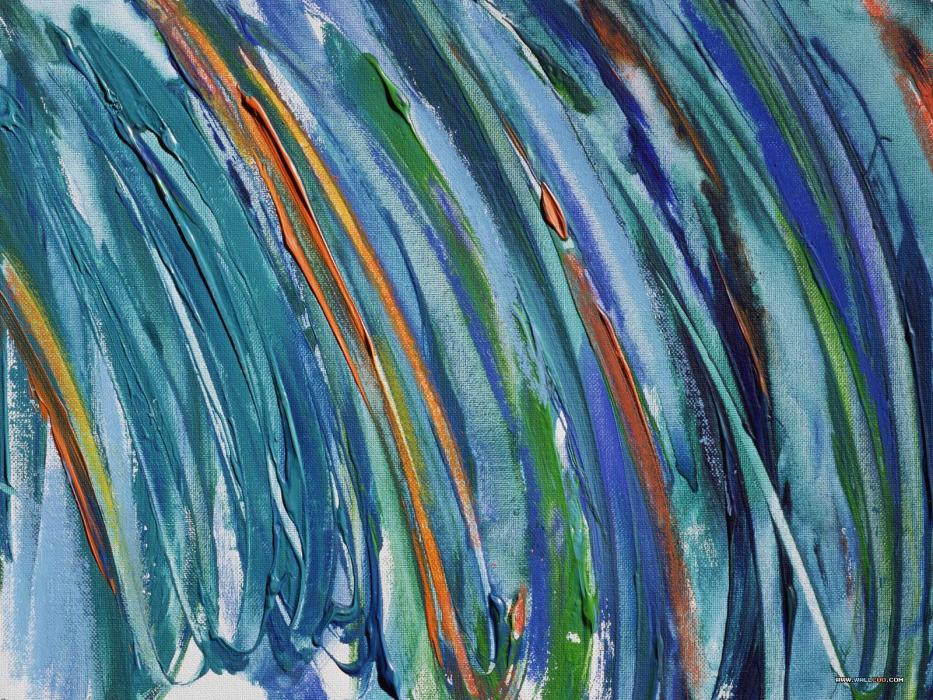 | 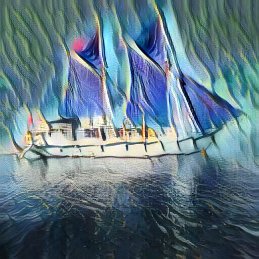 |


2.Guidance via semantic segmentation

Implemented the following paper: DING Z., LI P., YANG Q., LI S., GONG Q.: Regional
style and color transfer. In 2024 5th International Conference
on Computer Vision, Image and Deep Learning (CVIDL) (2024).

#### Key algorithmic steps:
- extract foreground using pre-trained DeepLabV3 model (`Style_3DGS/localized_style_transfer.py`)
- nearest pixel resampling to match sizes (`Style_3DGS/localized_style_transfer.py`)
- RGB to LAB conversion (`Style_3DGS/localized_style_transfer.py`)
- LAB to RGB conversion (`Style_3DGS/localized_style_transfer.py`)
- applying and projecting using PCA (`Style_3DGS/localized_style_transfer.py`)
- CDF matching (`Style_3DGS/localized_style_transfer.py`)
- final combination (`Style_3DGS/localized_style_transfer.py`)

#### Run
```bash
python Style_3DGS/run_semantic_segm.py --content input/content/brad_pitt.jpg --style input/style/brushstrokes.jpg --file_name test_segm
```

<details>
<summary><span style="font-weight: bold;">More Command Line Arguments for run_semantic_segm.py</span></summary>

  #### --content
  Path to the content image
  #### --style
  Path to the style image
  #### --output 
  Output directory
  #### --file_name
  Output file name without extension
  #### --use_depth
  Enable depth-aware stylization

</details>
<br>

#### Results

| Content Image | Style Image | Stylized Result |
|--------------|------------|----------------|
| 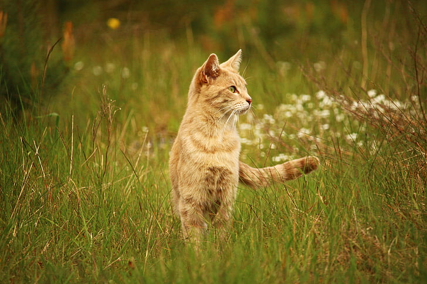 | 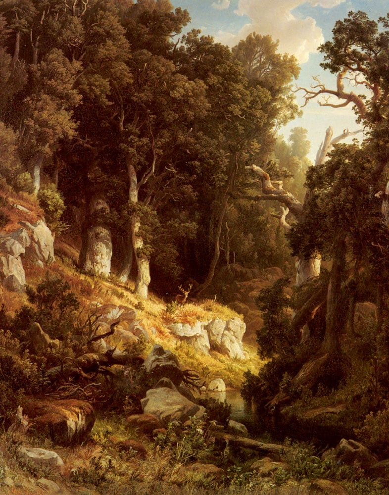 | 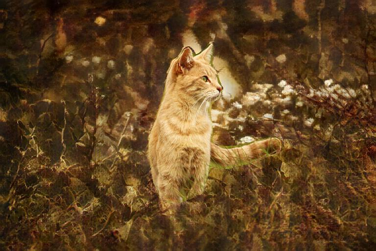 |


3. 3D(GS)

Implemented the following paper: SAROHA A., GLADKOVA M., CURRELI C., MUHLE
D., YENAMANDRA T., CREMERS D.: Gaussian splatting in
style. arXiv preprint arXiv:2403.08498 (2024) + with following changes:
- predicting SH (k=3) instead of view-dependent coloring, removal of view-dependent vector from Coloring Module -> Allows for real-time rendering using the original Gaussian Viewer after optimization, instead of having to wait for NN to predict RGB image
- use of a AdaIN encoder and image guide stylization

#### Key algorithmic steps:
- pre-compute stylized guide images using AdaIN (`Style_3DGS/train.py`) 
- modify L1 losses, add freeze after nr of iterations reached to initially stabilize the scene (`Style_3DGS/train.py`) 
- introduce the new loss working on stylized views (`Style_3DGS/train.py`) 
- introduced Coloring Module component (`Style_3DGS\scene\gaussian_model.py`)
- modified Gaussian Model to use the globally stylized encoded image (`Style_3DGS\scene\gaussian_model.py`)
- modified renderer to work with the Coloring Module (and all other smaller changes related)(`Style_3DGS\gaussian_renderer\__init__.py`)

#### Run
```bash
python Style_3DGS/run_3dgs.py --content input/3dgs/bathtub_0121/images --style input/style/brushstrokes.jpg --output output/bathtub_main
```

<details>
<summary><span style="font-weight: bold;">More Command Line Arguments for run_depth.py</span></summary>

  #### --content
  Path to the content directory containing original model views
  #### --style
  Path to the style image
  #### --output 
  Output directory
  #### --use_depth
  Enable depth-aware stylization

</details>
<br>

#### Results

| Content Views (Dir) | Style Image | Stylized Result |
|---------------------|------------|----------------|
| 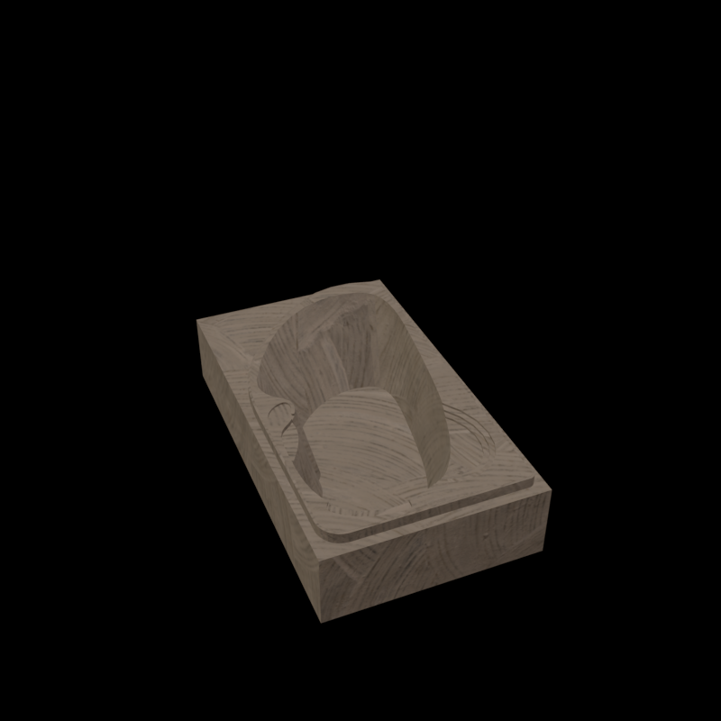 |  |  |
| 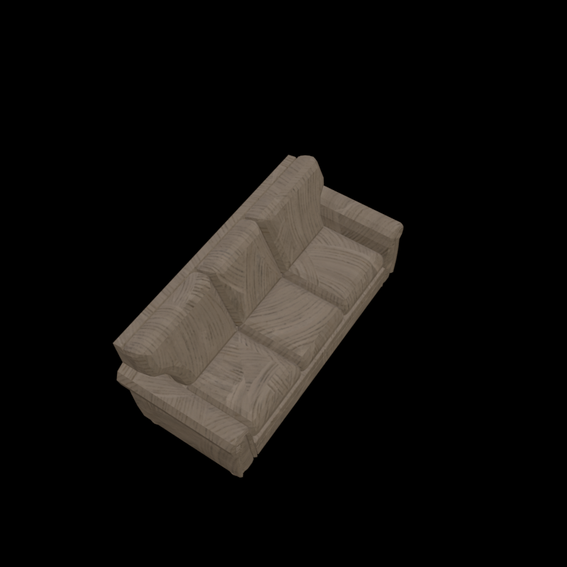 |  |  |


4. Video Style Transfer
#### Key algorithmic steps:
 - Running per frame (video/utils.py apply_style_transfer_multi_ada())
 - Estimating Optical Flow (video/utils.py estimate_optical_flow())
 - Warping (video/utils.py warp_image())
 - Blending frames (video/utils.py apply_style_transfer_multi_ada())
 - Running with different styles (video/utils.py apply_style_transfer_multi())
#### To Run
```bash
python test_video_st.py
```
#### Results
See video/outputs for outputs

| Original Video | Multi-Style Transfer Video | Video Style Transfer with Depth |
|---------------|---------------------------|--------------------------------|
|  |  | 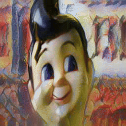 |


5. Depixilize Style Transfer
#### Key algorithmic steps:
All steps mentioned vectorization function (pixel_art/utils.py vectorization())
 - Create Similarity Graph (pixel_art/utils.py create_similarity_graph())
 - Process Diagonal Edges (pixel_art/utils.py process_diagonal_edges())
 - Generate Voronoi Cells (pixel_art/utils.py create_voronoi_cells())
 - Remove Low-Valency Voronoi Points (pixel_art/utils.py calculate_valencies() remove_valency_2_voronoi_points())
 - Apply Voronoi Smoothing using Chaikin's Algorithm (pixel_art/utils.py smooth_voronoi_graph())
#### To Run
```bash
#Uncomment vectorization() and run 
python pixel_art/utils.py
```
#### Results

| Pixelized Image | Depixelized Image | Style Image | Stylized Result |
|-----------------|-------------------|------------|-----------------|
|  | 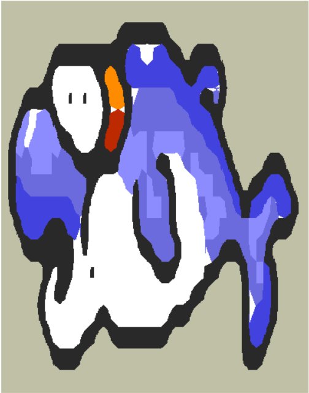 | 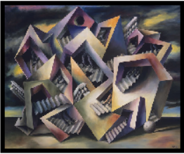 | 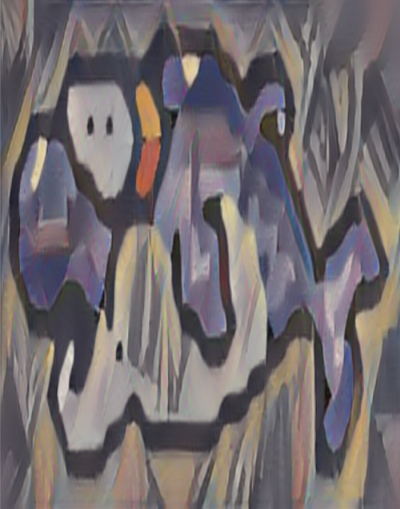 |

6. Color Palette Control in Pixel art
#### Key algorithmic steps:
Handling color palette merging using 3 methods
 - Calculates the Euclidean distance in RGB space (gui/second_page.py _recolor_image())
 - Computes the Euclidean distance in LAB space (gui/second_page.py _recolor_image_LAB())
 - Applies Floyd-Steinberg dithering and error diffusion (gui/second_page.py _recolor_image_floyd())
 - Resampling using opencv methods and handling brightness and contrast (gui/second_page.py _convert_image())
#### To Run
```bash
Use the ui to view this component as it is integrated with pygame 
```
#### Results

| Content Image | LAB Color Space (Borkfest) | RGB Color Space (Sweetie-16) | Floyd-Steinberg (Slso8) |
|--------------|----------------------------|-----------------------------|-------------------------|
| 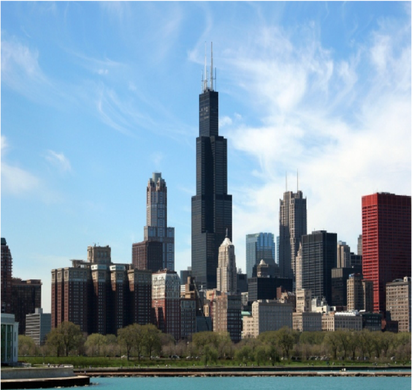 | 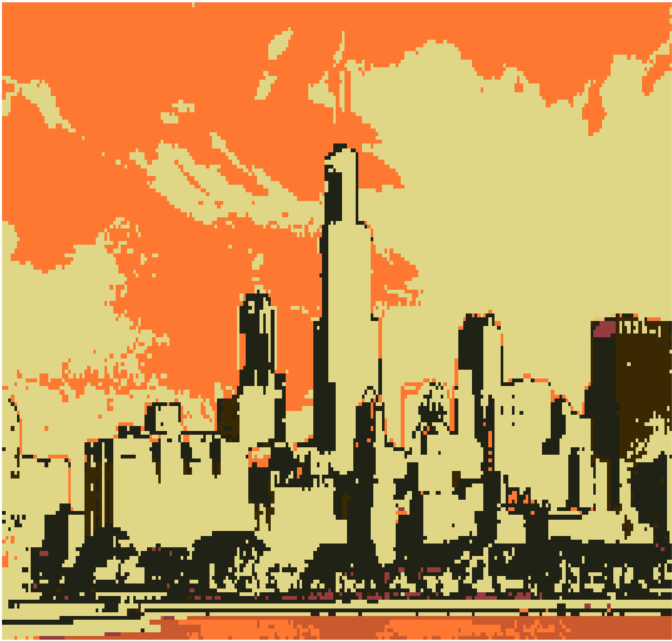 | 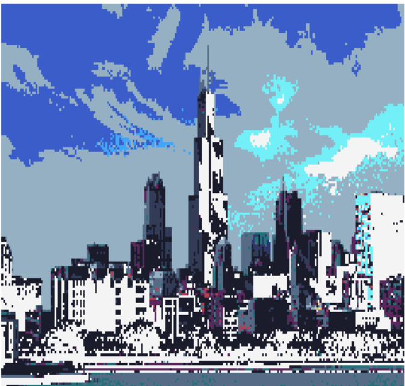 | 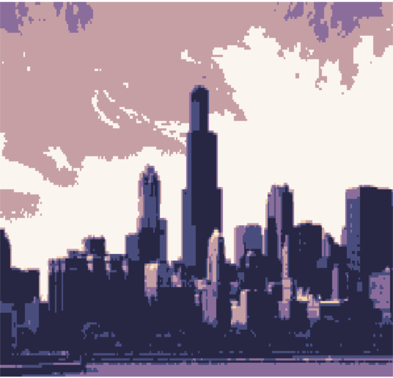 |